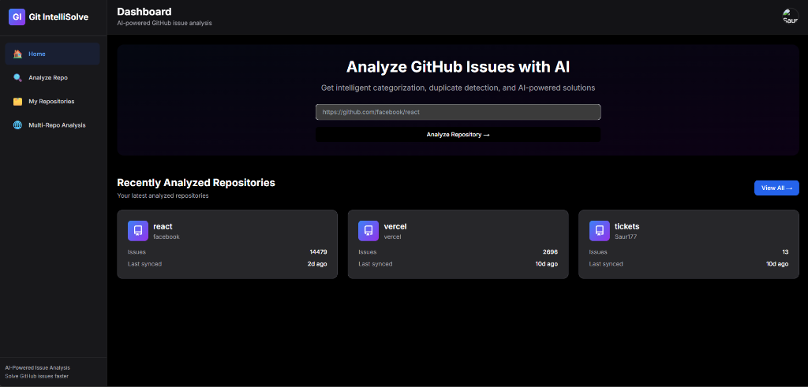
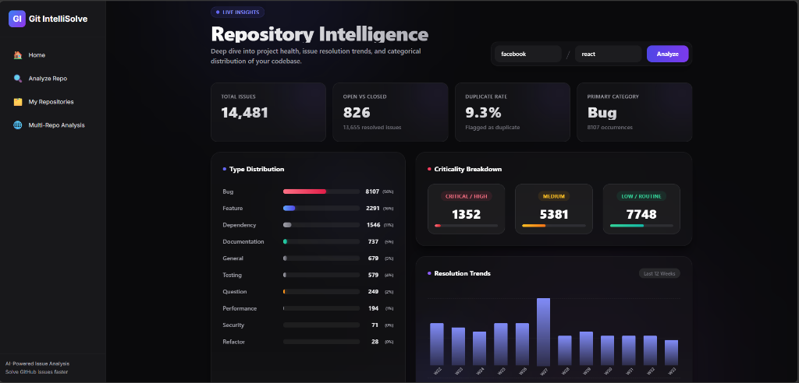
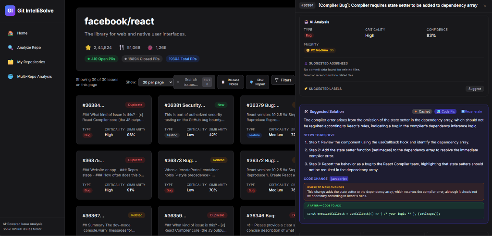

# Git IntelliSolve — AI-Powered GitHub Issue Manager

> Analyze, prioritize, and resolve GitHub issues faster using AI.

[**⚡ Visit Live App**](https://git-intellisolve.vercel.app)

---

## Screenshots

### 🖥️ Dashboard Home


### 📊 Repository Intelligence & Analytics


### 🤖 AI Issue Detail & Suggested Code Fixes


---

## Features

### Core
- **Repository Analysis** — Fetch and cache all issues from any GitHub repo
- **AI Issue Triage** — Auto-classify issues by type (Bug, Feature, Security, etc.) and criticality (Critical → Low)
- **AI Solutions** — GPT-generated fix suggestions with code context from the indexed repository
- **Solution Regeneration** — Delete stale solutions and generate fresh ones on demand
- **Duplicate Detection** — Identify similar/duplicate issues automatically
- **Full-Text Search** — Search across all cached issues instantly

### AI Features
| Feature | Description |
|---|---|
| 🏷️ **Label Suggestions** | Recommended GitHub labels per issue |
| 📊 **Priority Scoring** | ML-style priority score (0–100) per issue |
| 👥 **Auto-assign Suggestions** | Top-3 suggested assignees based on commit history |
| 📝 **Release Notes Generator** | GPT-generated release notes from closed milestone issues |
| 🛡️ **Risk Assessment Report** | Project health & risk report with PDF export |

### Views
- **Card View** — Rich issue cards with AI badges
- **Table View** — Sortable, filterable table
- **Analytics Dashboard** — Charts for type breakdown, criticality, weekly trends, duplicate rate

---

## Tech Stack

| Layer | Technology |
|---|---|
| Frontend | Next.js 16, TypeScript, Tailwind CSS |
| Backend | FastAPI (Python), Uvicorn |
| Database | MongoDB Atlas & Atlas Vector Search |
| AI | OpenAI GPT-4o-mini & OpenAI Embeddings (`text-embedding-3-small` at 384 dimensions) |
| Auth | JWT + GitHub OAuth + Google OAuth |

---

## Getting Started

### Prerequisites
- Node.js 18+
- Python 3.10+
- MongoDB Atlas cluster (required for Atlas Vector Search)
- OpenAI API key
- GitHub OAuth App (Client ID + Secret)

### Environment Variables

**Backend** — create `be/.env`:
```env
MONGO_URI=mongodb+srv://<username>:<password>@cluster.mongodb.net/git_intellisolve?retryWrites=true&w=majority
OPENAI_API_KEY=sk-...
GITHUB_CLIENT_ID=...
GITHUB_CLIENT_SECRET=...
GOOGLE_CLIENT_ID=...
GOOGLE_CLIENT_SECRET=...
JWT_SECRET_KEY=your-secret-key
ALLOWED_ORIGINS=http://localhost:3000,http://127.0.0.1:3000
FRONTEND_URL=http://localhost:3000
GOOGLE_REDIRECT_URI=http://localhost:8000/api/auth/google/callback
```

---

## MongoDB Atlas Vector Search Setup

This project utilizes MongoDB Atlas Vector Search for issue deduplication and source-code context RAG. 

You must set up a Search Index named **`vector_index`** on both the `issue_vectors` and `code_vectors` collections:

### 1. Issue Similarity Search Index
*   **Collection**: `issue_vectors`
*   **Index Name**: `vector_index`
*   **Index Type**: JSON Editor
*   **Index Definition**:
    ```json
    {
      "fields": [
        {
          "type": "vector",
          "path": "embedding",
          "numDimensions": 384,
          "similarity": "cosine"
        },
        {
          "type": "filter",
          "path": "repo"
        },
        {
          "type": "filter",
          "path": "state"
        }
      ]
    }
    ```

### 2. Code Search Index
*   **Collection**: `code_vectors`
*   **Index Name**: `vector_index`
*   **Index Type**: JSON Editor
*   **Index Definition**:
    ```json
    {
      "fields": [
        {
          "type": "vector",
          "path": "embedding",
          "numDimensions": 384,
          "similarity": "cosine"
        },
        {
          "type": "filter",
          "path": "repo"
        }
      ]
    }
    ```

**Frontend** — create `fe/.env.local`:
```env
NEXT_PUBLIC_API_URL=http://localhost:8000
```

### Run Locally

**Backend:**
```bash
cd be
pip install -r requirements.txt
uvicorn app.main:app --reload --port 8000
```

**Frontend:**
```bash
cd fe
npm install
npm run dev
```

Open [http://localhost:3000](http://localhost:3000)

---

## Vercel Deployment Setup

If deploying the Frontend and Backend as separate Vercel projects (e.g. `https://git-intellisolve.vercel.app` and `https://git-intellisolve-be.vercel.app`), configure the following environment variables:

### 1. Backend Environment Variables (on `git-intellisolve-be`)
- `MONGO_URI` — Connection string to MongoDB Atlas.
- `OPENAI_API_KEY` — API Key for completions and embeddings.
- `ALLOWED_ORIGINS` — Comma-separated list of allowed origins, e.g., `https://git-intellisolve.vercel.app,http://localhost:3000` (must include your deployed frontend URL).
- `FRONTEND_URL` — Base URL of your frontend redirect destination, e.g., `https://git-intellisolve.vercel.app`.
- `GOOGLE_REDIRECT_URI` — Deployed callback URI, e.g., `https://git-intellisolve-be.vercel.app/api/auth/google/callback`.
- `GOOGLE_CLIENT_ID` & `GOOGLE_CLIENT_SECRET` — Google OAuth credentials.
- `GITHUB_CLIENT_ID` & `GITHUB_CLIENT_SECRET` — GitHub OAuth credentials.

### 2. Frontend Environment Variables (on `git-intellisolve`)
- `NEXT_PUBLIC_API_URL` — Deployed backend URL, e.g., `https://git-intellisolve-be.vercel.app` (without trailing slash).

### 3. Google Developer Console Configuration
For your OAuth Client ID under **APIs & Services -> Credentials**:
- **Authorized JavaScript origins**: Add `http://localhost:3000` and `https://git-intellisolve.vercel.app`.
- **Authorized redirect URIs**: Add `http://localhost:8000/api/auth/google/callback` and `https://git-intellisolve-be.vercel.app/api/auth/google/callback`.

---

## API Endpoints

| Method | Path | Description |
|---|---|---|
| `POST` | `/api/auth/login` | Email/password login |
| `GET` | `/api/auth/me` | Get current user |
| `POST` | `/api/github/analyze` | Analyze & cache a repository |
| `GET` | `/api/github/issues` | List cached issues |
| `GET` | `/api/analytics/summary` | Issue analytics for a repo |
| `GET` | `/api/ai/label-suggestions/{owner}/{repo}/{number}` | AI label suggestions |
| `GET` | `/api/ai/priority-score/{owner}/{repo}/{number}` | Priority score |
| `GET` | `/api/ai/suggest-assignees/{owner}/{repo}/{number}` | Auto-assign suggestions |
| `GET` | `/api/ai/milestones/{owner}/{repo}` | List milestones |
| `POST` | `/api/ai/release-notes` | Generate release notes |
| `GET` | `/api/ai/risk-report/{owner}/{repo}` | Risk assessment report |

---

## Risk Assessment Report

The **🛡️ Risk Report** button on the repository page generates a comprehensive AI-powered risk assessment including:

- Overall risk score (0–100) with level (Low / Medium / High / Critical)
- Executive summary
- Issue statistics (total, open, close rate, duplicate rate, stale issues)
- Risk area scores: Code Quality, Security, Tech Debt, Team Velocity, Reliability
- Top 3–5 identified risks with mitigations
- Numbered recommendations for future projects
- Hot-spot keyword analysis of open issues
- **Direct PDF download** (no print dialog)

---

## Project Structure

```
├── fe/                  # Next.js frontend
│   └── app/
│       ├── components/  # UI components
│       ├── services/    # API service functions
│       └── repository/  # Repository page
└── be/                  # FastAPI backend
    └── app/
        ├── api/         # Route handlers
        ├── db/          # MongoDB client
        └── utils/       # GitHub fetcher, code indexer
```
